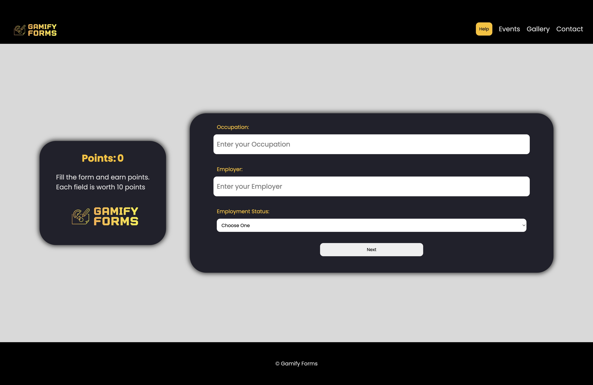
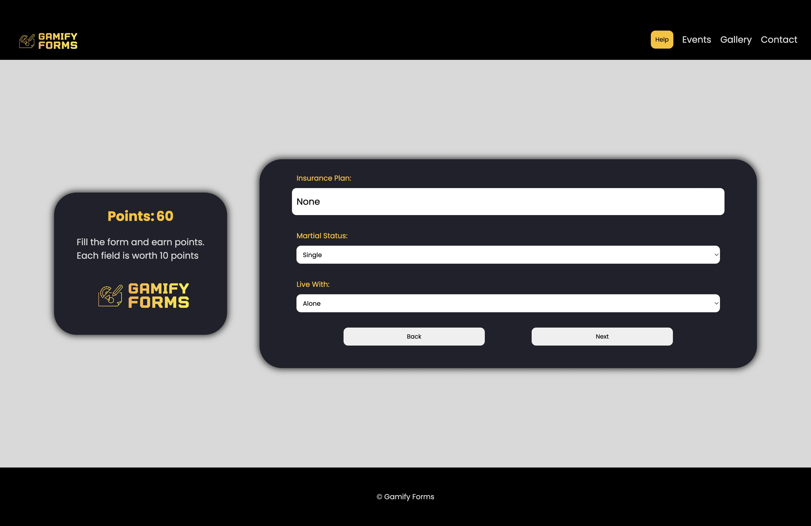
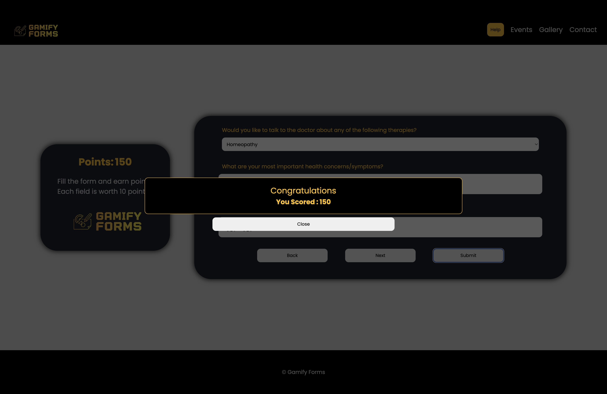

<h1>Gamify Forms</h1>

This website makes filling forms a non tiring job, and makes it rewarding to fill them.
<h2>General Information</h2>

<ul>
<li>It works as score per answer, each answer is awarded with certain points.</li>
</ul><ul>
<li>More you fill, more you get.</li>
</ul><ul>
<li>It encourages users to fill their data and enjoy it rather than making it a trouble.</li>
</ul><h2>Technologies Used</h2>

<ul>
<ul align="center">

 
</ul>
</ul><h2>Features</h2>

<ul>
<li>Responsive</li>
</ul><ul>
<li>Clean UI</li>
</ul><h2>Screenshots</h2>

<h2>Setup</h2>

Clone the repo and make the changes as per your form requirements.
<h5>Steps</h5><ul>
<li><code>git clone https://github.com/TartejBrothers/Gamify-Forms.git</code></li>
</ul><ul>
<li><code>cd Gamify-forms-main</code></li>
</ul><h2>Project Status</h2>

It is completed and hosted on https://gamifyforms.web.app/
<h2>Improvements</h2>

<ul>
<li>More questions</li>
</ul><ul>
<li>Better Animations</li>
</ul><h2>Contact</h2>

